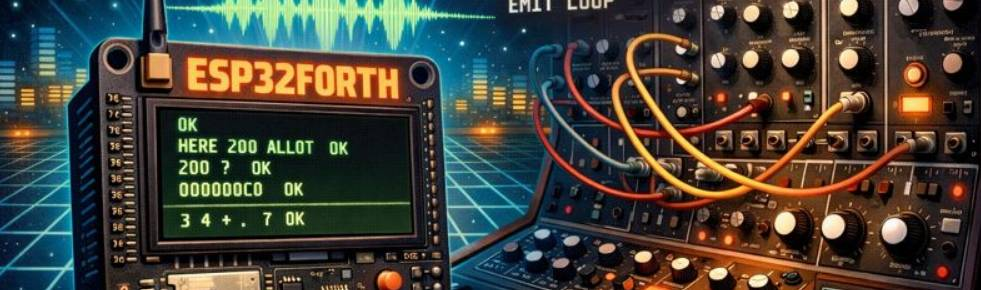

# ESP32FORTH-Synth
<h2>The SYNTH project</h2>

This ambitious project is an attempt to program a musical synthesizer by exploiting hardware and software components:

<ul>
  <li>the ESP32 board</li>
  <li>the stereo DAC card</li>
  <li>the FORTH language with ESP32forth version 7.0.7.21a</li>
</ul>

